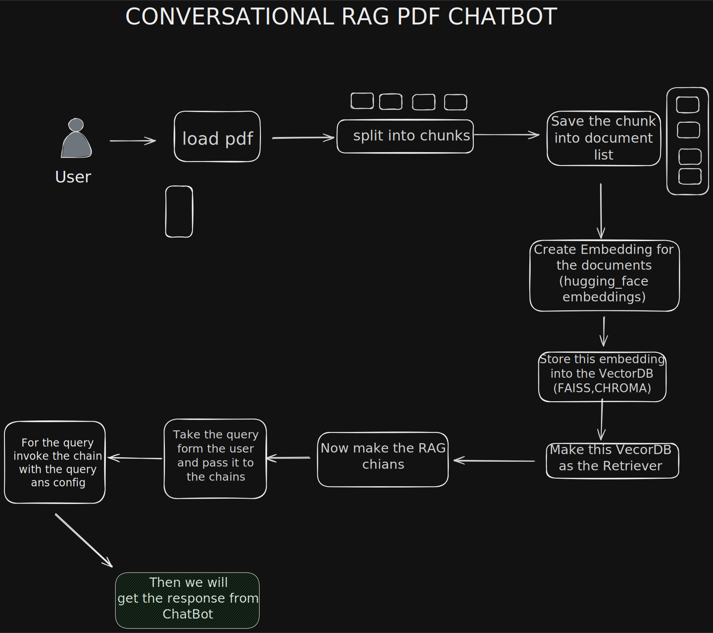

# Conversational RAG PDF Chatbot

A Streamlit application for asking source-grounded questions over uploaded PDF files. The app loads and chunks PDFs, embeds the chunks with Hugging Face sentence-transformer embeddings, stores them in a persistent Chroma vector database, combines dense retrieval with BM25 keyword search, and answers with a Groq-hosted LLM while preserving session-based conversation history.

The current implementation also includes retrieval evaluation and LLM-based answer quality scoring, so each answer can be inspected with retrieved evidence and scored for relevance, faithfulness, and completeness.

## Flow



The high-level flow is:

1. The user enters a Groq API key in the Streamlit sidebar.
2. The user uploads one or more PDF files.
3. Uploaded PDFs are temporarily written to disk.
4. `PyPDFLoader` extracts pages from each PDF.
5. `RecursiveCharacterTextSplitter` splits pages into overlapping chunks.
6. `HuggingFaceEmbeddings` converts each chunk into dense embeddings.
7. Chunks and embeddings are saved to a local Chroma collection in `chroma_db/`.
8. A BM25 retriever is built from the same chunks for keyword matching.
9. A Chroma retriever is built with MMR for diverse semantic retrieval.
10. BM25 and Chroma are combined with an `EnsembleRetriever`.
11. A history-aware RAG chain rewrites follow-up questions using chat history.
12. The retriever returns relevant PDF chunks.
13. The LLM answers only from retrieved context.
14. Retrieved source chunks are shown in the UI.
15. The answer is evaluated and appended to `evaluation_results.csv`.

## Features

- **Multi-PDF upload**: Upload one or more PDF files and build a shared knowledge base from all of them.
- **Persistent Chroma vector store**: Dense embeddings are stored locally in `chroma_db/`.
- **Hybrid retrieval**: Uses both BM25 keyword search and Chroma dense retrieval.
- **MMR semantic retrieval**: Chroma retrieval uses maximal marginal relevance to reduce duplicate context.
- **Conversation history**: Follow-up questions are rewritten into standalone questions using prior chat messages.
- **Session isolation**: Chat history is stored per `session_id` in Streamlit session state.
- **Traceable answers**: Retrieved evidence is displayed in tabs for source preview and full retrieved chunks.
- **Answer quality evaluation**: Each response is scored by an evaluator LLM for relevance, faithfulness, and completeness.
- **Retrieval evaluation**: Retriever output is checked against expected page-level test cases.
- **Polished Streamlit UI**: Sidebar setup, status summary, chat interface, evidence tabs, and answer quality metrics.

## Project Structure

- `app.py` - Streamlit entry point, UI styling, upload handling, knowledge-base building, chat flow, evidence rendering, and answer evaluation.
- `config/settings.py` - Environment loading and model, chunking, and tracing settings.
- `src/pdf_loader.py` - PDF loading and chunk splitting.
- `src/embeddings.py` - Hugging Face embedding model setup.
- `src/vector_store.py` - Chroma vector store creation and persistence.
- `src/retrievers/bm25_retriever.py` - Sparse BM25 keyword retriever.
- `src/retrievers/chroma_retriever.py` - Dense Chroma retriever using MMR.
- `src/retrievers/hybrid_retriever.py` - Ensemble retriever that combines BM25 and Chroma.
- `src/prompts.py` - Prompt templates for question rewriting and grounded answering.
- `src/memory.py` - Streamlit-backed chat history storage by session ID.
- `src/rag_chain.py` - History-aware conversational RAG chain assembly.
- `evaluation/retrieval_eval.py` - Page-level retrieval evaluation with hit rate, recall, precision, and F1.
- `evaluation/llm_eval.py` - LLM-based answer evaluator.
- `evaluation/test_cases.json` - Retrieval evaluation questions and expected pages.
- `evaluation_results.csv` - Appended answer evaluation results.
- `assets/rag_chatbot.svg` - README flow diagram.
- `chroma_db/` - Local persisted Chroma database.

## How It Works

### 1. App startup

`app.py` starts the Streamlit interface and asks for a Groq API key. When the key is provided, the app creates a `ChatGroq` LLM using the model configured in `config/settings.py`.

The app also initializes Streamlit session state for:

- chat messages
- the active RAG chain
- processed file names
- retrieved context from the latest answer
- latest answer evaluation
- per-session LangChain chat history

### 2. PDF upload and preprocessing

When the user uploads PDFs and clicks **Build Knowledge Base**, each uploaded file is saved to a temporary `.pdf` file and passed to `load_and_split()` in `src/pdf_loader.py`.

That function:

- loads pages with `PyPDFLoader`
- splits content with `RecursiveCharacterTextSplitter`
- uses `CHUNK_SIZE` and `CHUNK_OVERLAP` from `config/settings.py`
- preserves PDF metadata such as page number, which is later used for evidence display and retrieval evaluation

Temporary uploaded files are deleted after processing.

### 3. Embedding generation

`src/embeddings.py` creates a `HuggingFaceEmbeddings` instance with:

```python
EMBEDDING_MODEL = "all-MiniLM-L6-v2"
```

These embeddings represent PDF chunks as dense vectors for semantic search.

### 4. Chroma vector store

`src/vector_store.py` creates a Chroma vector store:

```python
Chroma.from_documents(
    documents,
    embeddings,
    persist_directory="./chroma_db"
)
```

This stores embeddings locally in `chroma_db/`, allowing the dense retrieval layer to use Chroma instead of an in-memory-only index.

### 5. BM25 keyword retrieval

`src/retrievers/bm25_retriever.py` builds a BM25 retriever from the split PDF chunks:

```python
retriever.k = 4
```

BM25 helps when the user asks about exact terms, names, definitions, formulas, or phrases that lexical matching can catch better than dense embeddings alone.

### 6. Chroma dense retrieval with MMR

`src/retrievers/chroma_retriever.py` converts the Chroma vector store into a retriever using maximal marginal relevance:

```python
search_type = "mmr"
search_kwargs = {
    "k": 6,
    "fetch_k": 15
}
```

MMR first fetches a broader candidate set and then selects chunks that are both relevant and diverse, which helps avoid returning several near-duplicate chunks.

### 7. Hybrid retrieval

`src/retrievers/hybrid_retriever.py` combines BM25 and Chroma with LangChain's `EnsembleRetriever`:

```python
EnsembleRetriever(
    retrievers=[bm25, chroma],
    weights=[0.5, 0.5]
)
```

This gives equal weight to sparse keyword matching and dense semantic retrieval. The result is a more balanced retriever that can handle both exact wording and meaning-based queries.

### 8. Retrieval evaluation

`evaluation/retrieval_eval.py` evaluates a retriever against `evaluation/test_cases.json`.

Each test case contains:

- a question
- a list of expected PDF pages

For each question, the evaluator:

- invokes the retriever
- extracts retrieved page numbers from document metadata
- compares retrieved pages with expected pages
- computes recall
- computes precision
- computes F1
- tracks hit rate
- prints detailed and final results

The app calls this evaluation while building the knowledge base so retrieval behavior can be inspected from the console.

### 9. Conversational RAG chain

`src/rag_chain.py` builds the final chain in three layers:

- `create_history_aware_retriever()` rewrites the latest question using chat history.
- `create_stuff_documents_chain()` passes retrieved context into the answer prompt.
- `create_retrieval_chain()` combines retrieval and answer generation.

The chain is wrapped in `RunnableWithMessageHistory`, using:

```python
input_messages_key = "input"
history_messages_key = "history"
output_messages_key = "answer"
```

This allows questions like "What about the second method?" to be interpreted using previous turns in the same session.

### 10. Chat history and sessions

`src/memory.py` stores chat history inside Streamlit session state:

```python
st.session_state.store[session_id] = ChatMessageHistory()
```

The sidebar exposes a `Session ID` field. Different session IDs keep separate histories, which is useful when testing multiple conversations against the same uploaded documents.

### 11. Grounded answer generation

The QA prompt in `src/prompts.py` instructs the model to:

- answer only using retrieved context
- avoid external knowledge
- return a fixed fallback response when the answer is not present in the uploaded PDFs

Fallback response:

```text
I could not find information related to this question in the uploaded documents.
```

### 12. Evidence display

After each answer, the UI displays an **Evidence** section with two tabs:

- **Sources**: preview snippets from retrieved chunks, grouped by source number and PDF page.
- **Retrieved Chunks**: full retrieved chunk text for deeper inspection.

This makes it easier to verify whether the answer is grounded in the uploaded documents.

### 13. LLM answer evaluation

`evaluation/llm_eval.py` uses a separate Groq model:

```python
model = "llama-3.1-8b-instant"
temperature = 0
```

It evaluates each generated answer against the question and retrieved context, returning JSON with:

- `relevance`
- `faithfulness`
- `completeness`
- `overall_feedback`

The Streamlit app displays these values as metrics under **Answer Quality**.

Each evaluation row is appended to `evaluation_results.csv` with:

- question
- answer
- relevance
- faithfulness
- completeness
- feedback

## Configuration

The app reads environment variables from `.env`.

Required:

- `HF_TOKEN` - Hugging Face token used by the embedding model if your environment requires authenticated model access.

Entered in the app UI:

- `Groq API Key` - Used for answer generation and LLM-based evaluation.

Optional LangChain tracing variables:

- `LANGCHAIN_API_KEY`
- `LANGCHAIN_PROJECT`
- `LANGCHAIN_TRACING_V2`

Internal settings in `config/settings.py`:

```python
CHUNK_SIZE = 1000
CHUNK_OVERLAP = 200
EMBEDDING_MODEL = "all-MiniLM-L6-v2"
LLM_MODEL = "llama-3.3-70b-versatile"
```

## Setup

1. Create and activate a virtual environment.

```bash
python -m venv .venv
.venv\Scripts\activate
```

2. Install dependencies.

```bash
pip install -r requirements.txt
```

3. Create a `.env` file in the project root.

```env
HF_TOKEN=your_hugging_face_token_here

# Optional LangChain tracing
LANGCHAIN_API_KEY=your_langchain_api_key_here
LANGCHAIN_PROJECT=conversational-rag-pdf-chatbot
LANGCHAIN_TRACING_V2=true
```

4. Run the app.

```bash
streamlit run app.py
```

## Usage

1. Open the Streamlit app in your browser.
2. Enter your Groq API key in the sidebar.
3. Keep the default session ID or enter a custom one.
4. Upload one or more PDF files.
5. Click **Build Knowledge Base**.
6. Ask questions in the chat input.
7. Review the answer, retrieved evidence, and answer quality metrics.
8. Check `evaluation_results.csv` for saved answer evaluation rows.

## Evaluation

### Retrieval evaluation

Retrieval evaluation uses `evaluation/test_cases.json`.

Example test case:

```json
{
    "question": "What is self attention?",
    "expected_pages": [7, 8, 9, 10]
}
```

To make retrieval evaluation meaningful for your own PDFs, update `evaluation/test_cases.json` with questions and expected page numbers that match the uploaded documents.

Metrics printed by `evaluate_retriever()`:

- **Hit Rate**: percentage of questions where at least one expected page was retrieved.
- **Recall**: how many expected pages were retrieved.
- **Precision**: how many retrieved pages were expected pages.
- **F1 Score**: harmonic mean of precision and recall.

### Answer evaluation

Answer evaluation runs after every chat response. It scores the answer against the retrieved context, not against external knowledge.

Scores:

- **Relevance**: how well the answer addresses the question.
- **Faithfulness**: whether the answer stays supported by the retrieved context.
- **Completeness**: whether the answer covers the expected information from the context.

Results are displayed in the UI and appended to `evaluation_results.csv`.

## Notes

- Multiple PDFs are supported.
- Chroma data is persisted under `chroma_db/`.
- Chat history is kept in Streamlit session state and isolated by `session_id`.
- The retriever is hybrid: BM25 handles keyword matching, while Chroma handles semantic matching.
- The Chroma retriever uses MMR with `k=6` and `fetch_k=15`.
- The BM25 retriever returns `k=4` matches.
- The ensemble uses equal weights for BM25 and Chroma.
- The app requires a Groq API key at runtime.
- The model is instructed not to use external knowledge.
- Scanned image-only PDFs may not work unless OCR is added before loading.

## Troubleshooting

- If embeddings fail to load, confirm that `HF_TOKEN` is set correctly in `.env`.
- If the app cannot start, check that your virtual environment is active and dependencies are installed.
- If Chroma errors occur, try deleting `chroma_db/` and rebuilding the knowledge base.
- If retrieval scores look poor, update `evaluation/test_cases.json` so the expected pages match the PDFs you uploaded.
- If answer evaluation fails, confirm that the Groq API key is valid and the evaluator model is available.
- If PDFs appear empty or incomplete, verify that they are text-based PDFs and not scanned images that require OCR.
